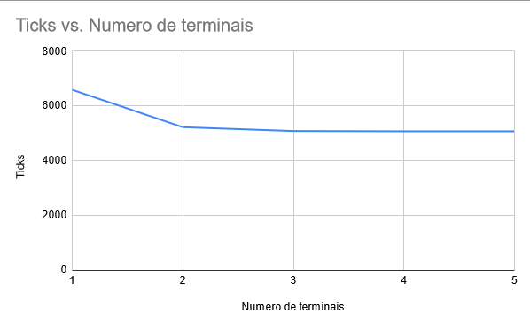

# puc-sistemas-operacionais-tp1

# Fase 1
https://github.com/ferreiraalves/puc-sistemas-operacionais-tp1/tree/phase-1

Este programa processa simula o processamento de uma fila de vendas de um cinema.
A aplicação lê um conjunto de configurações do arquivo `config.txt`.
As entradas são lidas a partir do arquivo `input.txt`. Ambos seguem o formato especificado na definição do tp.

## Instruções

Basta abrir o projeto como projeto maven. Por enquanto não existem dependências. O projeto possui duas execuções distintas.

O arquivo `Main.java` apresenta uma execução sem existência de priorização. Ou seja, as entradas são processadas à medida que são recebidas pela aplicação (fifo).

O arquivo `Priority.java`, por sua vez, apresenta uma execução seguindo as regras de negócio apresentadas na definição do TP.
Para que as regras sejam respeitadas, separamos as entradas em três filas distintas (`club`,`half`e `regular`) e processamos os dados de acordo
com suas regras específicas (club primeiro, half até 40% de lotação, etc..)

Além disso existe um arquivo `GenerateTestFile.java`, capaz de gerar um arquivo de entrada com valores aleatórios para testar o sistema.
O número de linhas geradas pode ser configurada a partir de uma variável interna. Valores de geração aleatória também podem ser alterados.

## Exemplo de execução
### Input
```
J07;17:00;CSP;T;R;7
J07;17:00;CSP;T;R;7
A10;17:00;CXX;D;C;2
C04;14:30;CSX;T;M;5
J07;17:00;CSX;T;R;7
```
### Output
```
Client 0 REGULAR J7 17:00 confirmou
Client 1 REGULAR J7 17:00 ocupado - mudou para D12 e confirmou
Client 2 CLUB A10 17:00 desistiu
Client 3 HALF C4 14:30 desistiu
Client 4 REGULAR J7 17:00 ocupado - mudou para H13 mas desistiu

#########REPORT POR SESSÃO#########

Sessão : 17:00
Vendas: 2
Assentos: 600
Percentual vendido: 0.33%

Sessão : 20:30
Vendas: 0
Assentos: 600
Percentual vendido: 0.00%

Sessão : 14:30
Vendas: 0
Assentos: 600
Percentual vendido: 0.00%

#########REPORT GLOBAL#########

Tempo de simulação: 28
Vendas: 2
Assentos: 1800
Percentual vendido: 0.11%
```

## Análise
Dado um mesmo conjunto de entradas, totalizando 1000 linhas geradas aleatoriamente, as execuções do sistema apresentaram os seguintes relatórios globais:

### Fifo
```
#########REPORT GLOBAL#########

Tempo de simulação: 4903
Vendas: 546
Assentos: 600
Percentual vendido: 91.00%
```

### Prioridade
```
#########REPORT GLOBAL#########

Tempo de simulação: 4903
Vendas: 532
Assentos: 600
Percentual vendido: 88.67%
```

Portanto , inicialmente podemos considerar o execução fifo como melhor, já que foi capaz de vender mais ingressos.
No entanto, ao considerarmos as regras de negócio apresentadas podemos fazer uma análise distinta a partir do processamento de logs.
Neste caso a expressão regular abaixo foi utilizada:

```regex
(CLUB|HALF).*(ocupado - desistiu|ocupado - não encontrou)
```

Ou seja, estamos contabilizando quantos clientes CLUB e MEIA ENTRADA que desistiram ou não conseguiram encontrar lugar devido a lotação.
No caso da execução fifo, tivemos 60 (39 dos quais são CLUB) casos em que isto ocorreu dentre os 317 clientes que se encaixam nestas categorias.

Já na execução por prioridade, tivemos apenas 33 desses casos. No entanto, a maior parte das ocorrências ocorreram para casos de meia entrada acima do limite de 40%.
Ao considerarmos apenas os clientes CLUB, apenas 8 não conseguiram assistir a sua sessão, sendo que todos desistiram após a primeira consulta.
Ou seja, todos os clientes CLUB que procuraram novos lugares foram capazes de encontrar um disponível.

Portanto, podemos considerar que este tipo de execução consegue respeitar a devida prioridade dos casos do CLUB e MEIA ENTRADA.

## Conclusão

Apesar de gerar uma venda maior de ingressos, o modelo Fifo não é ideal no caso apresentado pois poderia gerar uma insatisfação muito grande em clientes prioritários. Para a demanda apresentada no trabalho,
nosso grupo sugere a utilização do sistema de prioridades, pois ele é capaz de respeitar as regras de prioridade dos clientes CLUB e MEIA ENTRADA.

# Fase 2
https://github.com/ferreiraalves/puc-sistemas-operacionais-tp1/tree/phase-2

Nesta etapa, foi necessário realizar uma simulação do paralelismo entre vários terminais de atendimento. Para tanto uma nova classe `Totem` foi implementada.
Esta classe se torna responsável pelo gerenciamento dos atendimentos, sendo que cada totem só pode iniciar um atendimento após finalizar o atual.

## Alterações
- O arquivo de configuração agora aceita um valor para o número de totens de atendimento:
```
10x20
14:30,17:00,20:30
2
```
- O input gerado agora conta com um novo valor para determinar quando o próximo cliente chegará:
```
E03;14:30;CSP;T;C;7;4;
B03;14:30;CSP;T;M;6;4;
G13;20:30;CSP;D;R;1;7;
G11;20:30;CXX;T;C;8;6;
E10;17:00;CSP;T;C;1;4;
E12;14:30;CSX;D;M;5;9;
J13;14:30;CXX;D;R;2;9;
C12;14:30;CSP;D;R;5;9;
G17;14:30;CSP;T;R;5;4;
H02;20:30;CSP;T;R;2;9;
D11;17:00;CSP;D;R;9;7;
```
- O output agora mostra qual totem for responsável pelo atendimento de cada cliente:
```
Client 0	Totem 0		CLUB		E3		14:30		confirmou
Client 2	Totem 0		REGULAR		G13		20:30		confirmou
Client 1	Totem 1		HALF		B3		14:30		confirmou
Client 4	Totem 1		CLUB		E10		17:00		confirmou
Client 3	Totem 0		CLUB		G11		20:30		desistiu
Client 5	Totem 0		HALF		E12		14:30		desistiu
Client 6	Totem 0		REGULAR		J13		14:30		desistiu
Client 7	Totem 0		REGULAR		C12		14:30		confirmou
Client 8	Totem 0		REGULAR		G17		14:30		confirmou
Client 9	Totem 1		REGULAR		H2		20:30		confirmou
```
- O output agora mostra um relatório de quantos `ticks` foram necessários para concluir a simulação:
```
#########REPORT SECOND PHASE#########

Iterações: 66
Tempo simulado: 1:06
```

## Análise
O arquivo de entrada utilizado é o atualmente presente no repositório. O arquivo conta com 1000 entradas geradas aleatoriamente.
A simulação foi executada utilizando quantidades de totens distintos. Serão comparados o número de iterações necessárias para finalizar os atendimentos em cada um dos casos.
Os resultados podem ser observados na tabela abaixo:

|Terminais | Ticks | Tempo | Delta | Delta % |
---|---|---|---|--- 
|1 | 6588 | 109:48 |   |
|2 | 5225 | 87:05 | 1363 | 20.69%|
|3 | 5084 | 84:44 | 141 | 2.70%|
|4 | 5074 | 84:34 | 10 | 0.20%|
|5 | 5074 | 84:34 | 0 | 0.00%|



## Conclusão

Com base nos resultados, podemos perceber que o experimento foi bem sucedido. Ao aumentarmos o número de terminais, reduzimos o tempo necessário para realizar o processamento das entradas.

Em relação a questão do número ideal de totens levantada na proposta desta etapa, percebemos que a adição de novos terminais de atendimento possui retornos reduzidos. Ou seja, a partir de um determinado número de terminais, não existem ganhos nas métricas.
Em nosso experimento a adição do terminal número 5 demonstra isso com clareza, pois apresentou os mesmos resultados da simulação realizada com 4 terminais. Com isso, percebemos que os ganhos significativos ocorreram ao utilizarmos 2 ou 3 terminais. Sendo que o ganho com 2 terminais foi consideravelmente menor.

Sendo assim a recomendação do grupo é que sejam instalados 2 terminais de atendimento, pois novos terminais subsequentes podem não valer o custo com base no benefício apresentado.
É possível que a instalação de um terceiro terminal faça sentido, mas deve-se analisar se o custo justifica um ganho de apenas 2.70%.

# Fase 3

https://github.com/ferreiraalves/puc-sistemas-operacionais-tp1/tree/phase-3

Nesta fase foi pedido que o gerenciamento da aplicação possa ser feito a partir de forma semelhante a uma CLI, ou seja, tornar o programa capaz de receber parâmetros.
Com isso, ao executarmos a aplicação o usuário agora se depara com a seguinte mensagem:

```console
Enter command: 
```

A entrada dos comandos segue o modelo abaixo. No caso, apenas um comando deve ser passado, embora vários parâmetros sejam permitidos.
Caso sejam enviados parâmetros ou comandos não reconhecidos pela CLI uma mensagem de erro é exibida. O mesmo ocorre caso um parâmetro seja passado sem um valor equivalente.
```
comando [parâmetro valor]
```
### Comandos disponíveis
- **simular**: executa a simulação de venda de ingressos.
- **alterar**: altera os valores de configuração com base nos parâmetros.
- **totalizar**: Gera os relatórios finais das fases 1 e 2 com base na última simulação.
- **finalizar**: Finaliza a CLI.

### Parâmetros disponíveis
- **log**: define a saída do output. Valores: (tela, arquivo). `default: tela`
- **in**: Define o arquivo de entrada para a simulação. `default: input.txt`
- **out**: No caso de output para arquivo, define o arquivo de saída. `default: output.txt`
- **pontos**: Define quantos totens serão usados na simulação. `default: 2`


## Exemplos de utilização

###Simulação com 5 totens:
```console
alterar -pontos 5
simular
```
ou, de forma mais direta:
```console
simular -pontos 5
```

### Comparação entre execuções com o arquivo de entrada 1 e 2

Este exemplo executa duas simulações com o log da simulação impresso no console e gera relatórios em arquivos de saída distintos para cada execução.

```console
simular -log tela -in input1.txt
totalizar -log aquivo -out output1.txt

simular -log tela -in input2.txt
totalizar -log aquivo -out output2.txt
```

## Conclusão
Devido à forma como o trabalho foi planejado e executado, foi relativamente simples criar uma interface CLI para configuração e execução da simulação e do relatório.
A implementação da CLI tornou a ferramenta mais dinâmica, possibilitando a execução de diversos testes por parte de um potencial cliente sem a necessidade
de alteração do código.

Trabalho 10/10, faria de novo.